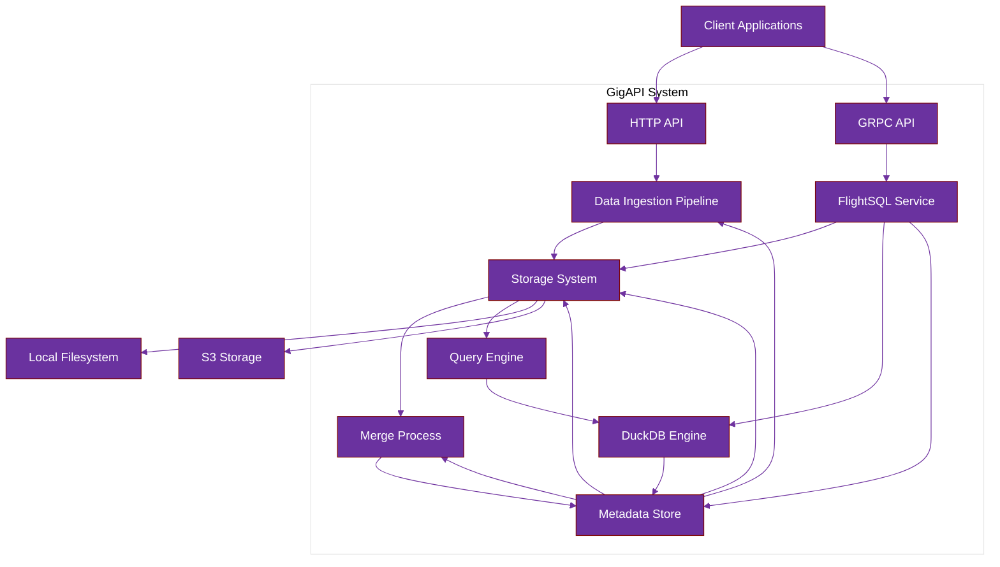

# 

#  GigAPI: The Infinite Timeseries Lakehouse

Like a durable parquet floor, GigAPI provides rock-solid data foundation for your queries and analytics

###  **Problem**
> Traditional "always-on" OLAP databases such as ClickHouse are fast but expensive to operate, complex to manage and scale, often promoting a cloud product. Data lakes and Lake houses are cheaper but can't always handle real-time ingestion or compaction and querying growing datasets such as timeseries brings back costly operations and complexity. Various _"opencore"_ poison solutions out there.

###  **Solution**
> GigAPI is a timeseries optimized "lakehouse" designed for realtime data - lots of it - and returning queries as fast as possible. By combining DuckDB's performance, FlightSQL efficiency and Parquet's reliablity with smart metadata we've created a simple, lightweight solution ready to decimate complexity and infrastructure costs for ourselves and others.
> GigAPI is _100% opensource - no open core or cloud product gimmicks_.


###  GigAPI Features

* Fast: DuckDB SQL + Parquet powered OLAP API Engine
* Flexible: Schema-less Parquet Ingestion & Compaction
* Simple: Low Maintenance, Portable Catalog, Infinitely Scalable
* Smart: Independent storage/write and compute/read components
* Extensible: Built-In Query Engine _(DuckDB)_ or BYODB _(ClickHouse, Datafusion, etc)_

> [!WARNING]  
> GigAPI is an open beta developed in public. Bugs and changes should be expected. Use at your own risk.


##  Usage

> Here's the most basic example. For more complex usage samples see the [examples](/examples) directory
```yml
services:
  gigapi:
    image: ghcr.io/gigapi/gigapi:latest
    container_name: gigapi
    hostname: gigapi
    restart: unless-stopped
    volumes:
      - ./data:/data
    ports:
      - "7971:7971"
    environment:
      - GIGAPI_ROOT=/data
      - GIGAPI_LAYER_0_NAME=default
      - GIGAPI_LAYER_0_TYPE=fs
      - GIGAPI_LAYER_0_URL=file:///data
```
###  Settings

| Env Var Name               | Description                                                         | Default Value |
|----------------------------|---------------------------------------------------------------------|---------------|
| `GIGAPI_ROOT`              | Root folder for all the data files                                  |               |
| `GIGAPI_MERGE_TIMEOUT_S`   | Base timeout between merges (in seconds)                            | `10`          |
| `GIGAPI_SAVE_TIMEOUT_S`    | Timeout before saving the new data to the disk (in seconds)         | `1`           |
| `GIGAPI_NO_MERGES`         | Disable merging                                                     | `false`       |
| `GIGAPI_UI`                | Enable UI for querier                                               | `true`        |
| `GIGAPI_MODE`              | Execution mode (`readonly`, `writeonly`, `compaction`, `aio`)       | `"aio"`       |
| `GIGAPI_METADATA_TYPE`     | Metadata Type (`json` for local, `redis` for distributed)           | `"json"`      |
| `GIGAPI_METADATA_URL`      | Metadata Type URL for redis (ie: `redis://redis:6379/0`             |               |
| `HTTP_PORT`                | Port to listen on for HTTP server                                   | `7971`        |
| `HTTP_HOST`                | Host to bind to for HTTP server                                     | `"0.0.0.0"`   |
| `HTTP_BASIC_AUTH_USERNAME` | Username for HTTP basic authentication                              |               |
| `HTTP_BASIC_AUTH_PASSWORD` | Password for HTTP basic authentication                              |               |
| `FLIGHTSQL_PORT`           | Port to run FlightSQL server                                        | `8082`        |
| `FLIGHTSQL_ENABLE`         | Enable FlightSQL server                                             | `true`        |
| `LOGLEVEL`                 | Log level (debug, info, warn, error, fatal)                         | `"info"`      |
| `DUCKDB_MEM_LIMIT`         | DuckDB memory limit (e.g. 1GB)                                      | `"1GB"`       |
| `DUCKDB_THREAD_LIMIT`      | DuckDB thread limit (int)                                           | `1`           |
| `GIGAPI_LAYER_X_NAME`      | X - layer index from 0. Layer unique name.                          |               |
| `GIGAPI_LAYER_X_TYPE`      | `fs` for file system, `s3` for s3                                   |               |
| `GIGAPI_LAYER_X_GLOBAL`    | `true` if all the cluster has an access to the layer                |               |
| `GIGAPI_LAYER_X_URL`       | path or url to s3                                                   |               |
| `GIGAPI_LAYER_X_TTL`       | timeout before send data to the next layer or drop it 0 for no drop | `0`           |

> You can override the defaults by setting these environment variables before starting the service.

<br>

##  Write Support
As write requests come in to GigAPI they are parsed and progressively appeanded to parquet files alongside their metadata. The ingestion buffer is flushed to disk at configurable intervals using a hive partitioning schema. Generated parquet files and their respective metadata are progressively compacted and sorted over time based on configuration parameters.

###  API
GigAPI provides an HTTP API for clients to write, currently supporting the InfluxDB Line Protocol format 

```bash
cat <<EOF | curl -X POST "http://localhost:7971/write?db=mydb" --data-binary @/dev/stdin
weather,location=us-midwest,season=summer temperature=82
weather,location=us-east,season=summer temperature=80
weather,location=us-west,season=summer temperature=99
EOF
```

###  FlightSQL

> [!NOTE]
> _FlightSQL ingestion is coming soon!_

###  Data Schema
GigAPI is a schema-on-write database managing databases, tables and schemas on the fly. New columns can be added or removed over time, leaving reconciliation up to readers.

```bash
/data
  /mydb
    /weather
      /date=2025-04-10
        /hour=14
          *.parquet
          metadata.json
        /hour=15
          *.parquet
          metadata.json
```

GigAPI managed parquet files use the following naming schema:
```
{UUID}.{LEVEL}.parquet
```

###  Parquet Compactor
GigAPI files are progressively compacted based on the following logic _(subject to future changes)_


| Merge Level   | Source | Target | Frequency              | Max Size |
|---------------|--------|--------|------------------------|----------|
| Level 1 -> 2  | `.1`   | `.2`   | `MERGE_TIMEOUT_S` = `10` | 100 MB   |
| Level 2 -> 3  | `.2`   | `.3`   | `MERGE_TIMEOUT_S` * `10` | 400 MB   |
| Level 3 -> 4  | `.3`   | `.3`   | `MERGE_TIMEOUT_S` * `10` * `10` | 4 GB     |


##  Read Support
As read requests come in to GigAPI they are parsed and transpiled using the GigAPI Metadata catalog to resolve data location based on database, table and timerange in requests. Series can be used with or without time ranges, ie for calculating averages, etc.

Query Data
```bash
$ curl -X POST "http://localhost:7972/query?db=mydb" \
  -H "Content-Type: application/json"  \
  -d {"query": "SELECT time, temperature FROM weather WHERE time >= epoch_ns('2025-04-24T00:00:00'::TIMESTAMP)"}
```

Series can be used with or without time ranges, ie for counting, calculating averages, etc.

```bash
$ curl -X POST "http://localhost:7972/query?db=mydb" \
  -H "Content-Type: application/json"  \
  -d '{"query": "SELECT count(*), avg(temperature) FROM weather"}'
```
```json
{"results":[{"avg(temperature)":87.025,"count_star()":"40"}]}
```

####  FlightSQL
GigAPI data can be accessed using FlightSQL GRPC clients in any language
```python
from flightsql import connect, FlightSQLClient
client = FlightSQLClient(host='localhost',port=8082,insecure=True,metadata={'bucket':'hep'})
conn = connect(client)
cursor = conn.cursor()
cursor.execute('SELECT count(*), avg(temperature) FROM weather')
print("rows:", [r for r in cursor])
```

####  GigAPI UI
The embedded GigAPI UI can be used to explore and query data using SQL with advanced features


####  Grafana
GigAPI can be used from Grafana using the InfluxDB3 Flight GRPC Datasource


> GigAPI readers can be implemented in any language and with any OLAP engine supporting Parquet files.

<br>

#### Layer support

GigAPI employs a "data layer" concept for efficient data storage and management. 
A "data layer" represents a storage location, which can be either a file system or an 
S3 bucket, where data is stored for a specified duration. 
Data within a layer undergoes merging operations and can be transferred between layers based on 
Time-to-Live (TTL) configurations.

##### Layers configuration

Layer configuration should be consistent across all readers and writers in the cluster. 
Layer names and paths must be identical throughout the cluster to ensure proper data access and management.

The metadata, stored either in JSON format or Redis, contains only the layer name. 
Each reader and writer determines the path to the parquet file based on this layer name.

#### Layer Configuration Breakdown

For each layer, the following parameters can be configured:

- `NAME`: A unique identifier for the layer.
- `TYPE`: The storage type (`fs` for file system, `s3` for S3 bucket).
- `URL`: The path or URL to the storage location.
- `GLOBAL`: Boolean indicating if the layer is accessible to all cluster nodes.
- `TTL`: Time-to-Live duration before data moves to the next layer (use `0` for no expiration).

Here's an example of layer configuration using environment variables:
```bash
# Local Storage, Fastest, 30 minutes TTL
GIGAPI_LAYERS_0_NAME=cache
GIGAPI_LAYERS_0_TYPE=fs
GIGAPI_LAYERS_0_URL=file:///data
GIGAPI_LAYERS_0_GLOBAL=false
GIGAPI_LAYERS_0_TTL=30m

# Remote Layer 1, Fast-enough, 4 weeks TTL
GIGAPI_LAYERS_1_NAME=s3
GIGAPI_LAYERS_1_TYPE=s3
GIGAPI_LAYERS_1_URL=s3://s3.server.hostname/bucket/prefix/to/layer
GIGAPI_LAYERS_1_AUTH_KEY=s3_api_key
GIGAPI_LAYERS_1_AUTH_SECRET=s3_api_secret
GIGAPI_LAYERS_1_GLOBAL=true
GIGAPI_LAYERS_1_TTL=4w

# Remote Layer 2, Slower, forever TTL
GIGAPI_LAYERS_2_NAME=r2
GIGAPI_LAYERS_2_TYPE=s3
GIGAPI_LAYERS_2_URL=s3://r2.server.hostname/bucket/prefix/to/layer
GIGAPI_LAYERS_2_AUTH_KEY=cloudflare_key
GIGAPI_LAYERS_2_AUTH_SECRET=clourflare_secret
GIGAPI_LAYERS_2_GLOBAL=true
GIGAPI_LAYERS_2_TTL=0
```

In this configuration:

1. The first layer (`GIGAPI_LAYERS_0_*`) is a local cache:
    - It uses the file system (`fs`) as the storage type.
    - Data is stored locally and is not globally accessible (`GLOBAL=false`).
    - Data remains in this layer for 10 seconds before moving to the next layer (`TTL=10s`).

2. The second layer (`GIGAPI_LAYERS_1_*`) is an S3 bucket:
    - It uses S3 as the storage type.
    - Data is globally accessible to all cluster nodes (`GLOBAL=true`).
    - Data remains in this layer indefinitely (`TTL=0`).

##  S3 Configuration

GigAPI supports S3-compatible storage for data layers. The S3 URL format is as follows:

```
s3://[endpoint_url]/[bucket]/[path/to/base]?[parameters]
```

The access key and secret key are provided in separate env variables:
- `GIGAPI_LAYERS_[X]_AUTH_KEY=api_key` - for access key
- `GIGAPI_LAYERS_[X]_AUTH_SECRET=api_secret` - for secret key

### URL Components:

- `endpoint_url`: The S3 endpoint URL (e.g., `s3.amazonaws.com` for AWS S3)
- `bucket`: Your S3 bucket name
- `path/to/base`: Optional path prefix within the bucket

### URL Parameters:

| Parameter | Description                                                                   | Default |
|-----------|-------------------------------------------------------------------------------|---------|
| secure    | Whether to use SSL. Set to `true` for most cases, `false` for local testing   | true    |
| url-style | S3 URL style. Use `vhost` for AWS S3, `path` for most other S3 implementations| vhost   |

### Examples:

1. AWS S3:
```
GIGAPI_LAYERS_X_URL=s3://s3.amazonaws.com/my-bucket/data
GIGAPI_LAYERS_X_AUTH_KEY=EXAMPLE_SECRET
GIGAPI_LAYERS_X_AUTH_SECRET=EXAMPLE_KEY
```

2. Local MinIO server:
```
GIGAPI_LAYERS_X_URL=s3://localhost:9000/gigapi?secure=false&url-style=path
GIGAPI_LAYERS_X_AUTH_KEY=minioadmin
GIGAPI_LAYERS_X_AUTH_SECRET=minioadmin

```

3. DigitalOcean Spaces:
```
GIGAPI_LAYERS_X_URL=s3://nyc3.digitaloceanspaces.com/my-space/data?url-style=path
GIGAPI_LAYERS_X_AUTH_KEY=EXAMPLE_KEY
GIGAPI_LAYERS_X_AUTH_SECRET=EXAMPLE_SECRET
```

### Security Considerations:

1. Always use `secure=true` in production environments to ensure encrypted connections.
2. Protect your access and secret keys. Consider using environment variables or a secrets management system instead of hardcoding them in the URL.
3. Use IAM roles and policies (for AWS) or equivalent access control mechanisms to limit permissions to the minimum necessary.

### Troubleshooting:

- If you encounter "Access Denied" errors, double-check your access key, secret key, and bucket permissions.
- For connection issues, verify the endpoint URL and ensure proper network access.
- When using non-AWS S3 implementations, you may need to set `url-style=path`.

> Note: Always refer to your specific S3 provider's documentation for any provider-specific configurations or limitations.

##   GigAPI Diagram




### Got Questions?
[](https://deepwiki.com/gigapi/gigapi)


### Contributors

&nbsp;&nbsp;&nbsp;&nbsp;[](https://github.com/gigapi/gigapi/graphs/contributors)

### Community

[](https://github.com/gigapi/gigapi/stargazers)

###### :black_joker: Disclaimers 

[^1]: DuckDB ® is a trademark of DuckDB Foundation. All rights reserved by their respective owners. [^1]
[^2]: ClickHouse ® is a trademark of ClickHouse Inc. No direct affiliation or endorsement. [^2]
[^3]: InfluxDB ® is a trademark of InfluxData. No direct affiliation or endorsement. [^3]
[^4]: Released under the MIT license. See LICENSE for details. All rights reserved by their respective owners. [^4]

